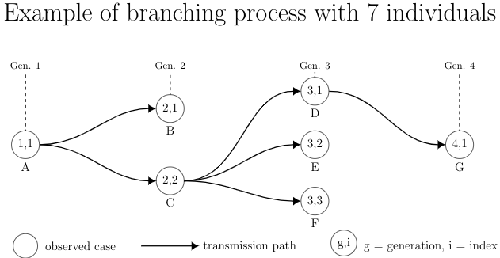
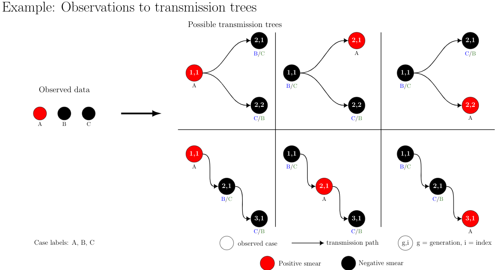

```{r setup, include=FALSE}
knitr::opts_chunk$set(echo = TRUE,
                      cache = TRUE,
                      warning = FALSE,
                      message = FALSE)
devtools::load_all()
library(InfectionTrees)
library(tidyr)
library(dplyr)
library(kableExtra)
library(ggplot2)
theme_set(theme_bw() + theme(axis.title = element_text()))
```


## Data generation

We can simulate from a branching process to form a data set of transmission trees or clusters (if we remove infector information from the transmission trees).  We simulate $K$ branching processes where the primary infector in each tree is the root of each transmission tree and the probability of infection of another individual is where $\bf{X}$ is a covariate matrix and $\beta$ is a vector of coefficients,
$$
p_i = logit^{-1} (\bf{X}_i\bf{\beta}).
$$
Then the number of **new** infectious individuals infected by individual $i$ is
$$
N_i \sim Geometric(p_i).
$$


To form a branching process, we begin with an initial infector who is the root node who we index as (1,1).  We then draw $N_{(1,1)} \sim Geometric(p_{(1,1)})$, the number of infections produced by individual (1,1).  These infections are part of generation 2 and so will be given indices $(2, 1), \dots, (2, N_{1,1})$.

The infection proceeds by marching **down the generations**.  We first draw $N_{(2,1)}$  (if individual (2,1) exists) and give these new infections indices $(3, 1), \dots, (3, N_{(2,1)})$.  We then draw $N_{(2,2)}$ and assign them indices $(3, N_{(2,1)} + 1), \dots, (3, \sum_{i=1}^{2}N_{2,i})$.  We repeat this process until all infections in generation 3 are achieved.  We then repeat the process beginning in generation 4.  This infection process is repeated until it naturally terminates (or too a maximum number of infections are drawn).  This process is illustrated in the below figure.

<center>

</center>

Then the data for a single transmission tree is a matrix of size $n$ where each row is the form $(label, g, i, \inf g, \inf i)$, where label denotes the individual and refers to her covariates, $(g,i)$ is the indexing of individual $A$ and $(\inf g, \inf i)$ is the infector ID or is denoted by $\emptyset$ to show that the infection originated from outside the cluster.  For example, the above transmission tree $T$ becomes
$$ T = \left (
\begin{array}{ccccc}
A& 1& 1& \emptyset& \emptyset&\\
B& 2& 1& 1& 1\\
C& 2& 2& 1& 1\\
D& 3& 1& 2& 2\\
E& 3& 2& 2& 2\\
F& 3& 3& 2& 2\\
G& 3& 4& 3& 1
\end{array}\right ),
$$
where $\emptyset$ means we assume the infection originates from the outside.


## Computing the likelihood of a tree $T$

Because we know the transmission tree, we know $N_{g,i}$, the number of infections transmitted by indivdual $(g,i)$.   In terms of our above matrix $T$, this is found by counting the number of infector generation, index pairs that equals the individual's own generation, index pair.  For example, in the above, $N_{(1,1)} = 2, N_{(2,1)} = 0, N_{(2,2)} = 3, N_{(3,1)} = 1, N_{(3,2)} = 0, N_{(3,3)} = 0, N_{(4,1)} = 0$.  The likelihood is then the product of independent geometric random variables with different probabilities of success $p_i$,
$$
L(T) = \prod_{j=1}^n (1-p_j)p_j^{N_j},
$$
where we use $j$ as the *label* of the individual.


## Computing the likelihood of an observed cluster $C$

In practice, we do not see the transmission tree $T$ but are instead working with a missing data problem.  We observe a *cluster* $C$ of individuals, which is a collection of individuals along with their covariates.  With respect to the above example matrix of $T$, we would say $C$ is a subset of $T$, specifically $C = (A, B, C, D, E, F, G)^T$.  We say that the size of $C$ is the number of individuals, $|C| = n$ or 7 in the above example.  We neither know the generation-index pairs nor the infector IDs of the individuals.

We thus compute the *total* likelihood $\mathcal{L}(C)$ of a cluster, which is equal to the sum of the likelihood across the set of all permissible transmission trees, $\mathcal{T}_C$,
$$
\mathcal{L}(C) = \sum_{T \in \mathcal{T}_C} L(T).
$$

### Permissible Transmission Trees 

We say a transmission tree $T \in \mathcal{T}_C$ is *permissible* if it is a possible outcome of our data generation process.  More specifcially, a transmission tree $T$ is permissible if it satifies the following criteria,

1. $T$ has $|C| = n$ nodes.
2. The $n$ individuals are placed into $g$ successive generations where $g$ is between 1 and $n$, inclusive.
3.  The number of individuals in each generation is a $g$-tuple $(n_1, \dots, n_g)$ such that $\sum_{j=1}^{g}{n_j} = n$ and $n_j > 0$ for $j =1, \dots, g$.
4.  There is exactly one root node so $n_1 =1$.
5. Each individual is indexed by $(h,i)$ which is the generation-index pair, where the index is the order of appearance within the generation, ranging between $i=1, 2, \dots, n_h$.
6.  For $g >1$, an individual $(g,i)$ has exactly one infector from generation $g-1$.  For $g=1$, the infector is denoted by $(\emptyset, \emptyset)$.
7.  Each individual is assigned a label.


**Ex. $C = (A,B,C)$ where individual $A$ has $X_A = 1$ and individuals $B$ and $C$ have $X_B = X_C = 0$**

The below figures shows the different trees in $\mathcal{T}_C$ where $|C| = 3$.  The size of $\mathcal{T}_C$ is $|\mathcal{T}_C| = 12$ if we consider individuals $A$, $B$, and $C$ to be distinguishable from one another.  If we say individuals $B$ and $C$ are indistinguishable from one another because they have the same value of $X_i=0$, then there are only 6 unique transmission trees.
<center>

</center>


## Obtaining the maximum likelihood estimate (MLE).

For observed independent clusters $C_1, \dots, C_M$, we would like to find the maximum likelihood estimate (MLE) of $\beta$
$$
\hat{\beta}^{(MLE)} = \arg \max_\beta \prod_{m=1}^M\mathcal{L}(C_m).
$$


However, if $|C_m| > 15$, this is infeasible because the space of $|
\mathcal{T}_C|$ is too large.  We can instead sample permissible transmission trees to solve an equivalent problem, maximizing the average likelihood.

Let the average likelihood of a single cluster $C$ be given by
$$
\bar{\mathcal{L}}(C) = \frac{\mathcal{L}(C)}{|\mathcal{T}_C|}
$$
and note that since $|\mathcal{T}_C|$ is not dependent on $\beta$ then the MLE is the same for both $\mathcal{L}(C)$ and $\bar{\mathcal{L}}(C)$,
$$
\hat{\beta}^{(MLE)} = \arg \max_\beta \prod_{m=1}^M\mathcal{L}(C_m)\\
 = \arg \max_\beta \prod_{m=1}^M\frac{1}{|\mathcal{T}_m|}\mathcal{L}(C_m)\\
= \arg \max_\beta \prod_{m=1}^M\bar{\mathcal{L}}(C_m).
$$

We approximate average likelihood for each cluster through Monte Carlo (MC) sampling.  For a given cluster $C$, we sample $K$  MC trees $T_1, \dots, T_K \in \mathcal{T}_C$and form estimates
$$
\hat{\mathcal{L}}_K(C): = \frac{1}{K} \sum_{i=1}^KL(T_i) \overset{a.s.}{\to} \bar{\mathcal{L}}(C).
$$


We then form our estimate $\hat{\beta}^{(MC)}$ from Monte Carlo (MC) samples from $\mathcal{T}_C$,
$$
\hat{\beta}^{(MC)} = \arg \max_\beta \prod_{m=1}^M\hat{\mathcal{L}}_K(Cm).
$$

The result is that (hopefully) $\hat{\beta}^{(MC)} \approx \hat{\beta}^{(MLE)}$ if $K$ is large.  However, the limits of branching processes are sometimes found to be 'non-standard', meaning non-normal.  As such, we demonstrate the usefulness of our methods through simulations.

## In summary

We maximize the approximate likelihood over a set of MC sampled trees for our observed cluster $C$.
