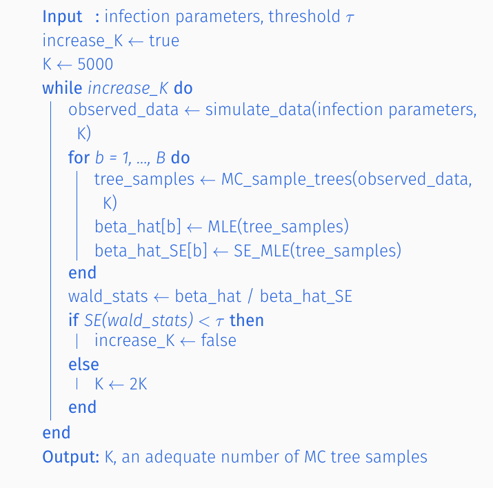

```{r setup, include=FALSE}
knitr::opts_chunk$set(echo = TRUE,
                      cache = TRUE,
                      warning = FALSE,
                      message = FALSE)
devtools::load_all()
library(InfectionTrees)
library(tidyr)
library(dplyr)
library(kableExtra)
library(ggplot2)
theme_set(theme_bw() + theme(axis.title = element_text()))
```


## Vignette goals

In this vignette we will

1. Explain why such a step is needed.

2. Describe an algorithm to ensure that we are sampling enough MC trees.

3. Discuss some of the implications, assumptions, and limitations of our algorithm.

## Why we need it

Our method of finding the best coefficients is dependent on sampling MC trees to approximate the likelihood.  The law of large numbers (LLN) tells us that the approximate likelihood will converge to the true likelihood as the number of MC samples $K$ increases.  At the same time, we hope that the MLE from the approximate likelihood will be close to the MLE from the true likelihood.

*A priori*, we do not know how many MC samples are enough to judge our estimates to be reliable.  This is why we propose the following algorithm to help us determine if our MC samples are giving us a good enough picture of the space of permissible transmission trees.

## The algorithm

Assume we observe $M$ clusters $C_1, \dots, C_M$  Then for $b= 1,  \dots, B$

1. Sample $K$  MC trees for each cluster.  We will denote this data sample of MC trees as $D_b$

2. Estimate $\hat{\beta}^{MC}_b$ and $SE\left(\hat{\beta}^{MC}_b\right)$ to form the Wald statistic
$$
Z_b = \frac{\hat{\beta}^{MC}_b}{SE\left(\hat{\beta}^{MC}_b\right )}
$$

3.  If $SE(Z_1, \dots, Z_B) \le 0.05$ then we say $K$ is enough MC samples.  Otherwise we let $K \leftarrow 2K$ and repeat the process.

## Implications, assumptions, and limitations

 The implicit assumption is that $Z_b$ has a normal distribution $Z_b \sim N\left (\frac{\hat{\beta}^{(MLE)}}{SE\left (\hat{\beta}^{(MLE)} \right )}, 1 \right )$ and then we are 95\% confident that $\hat{\beta}^{(MLE)} \in \left[Mean(\hat{\beta}_b) \pm 0.1\right ]$.
 
 The assumption that $Z_b$ has such a distribution may not always hold but can be checked through simulations.
 
 
 The algorithm is shown in pseudo-code here.
 
 <center>

 </center>
 
## Summary

In this section, we described why we need to assess whether our estimates are reliable, proposed an algorithm for this assessment, and discussed some advantages and disadvantages of our algorithm.  To see this algorithm in action, please see [this vignette](simulations-enough-mc-trees.html)
