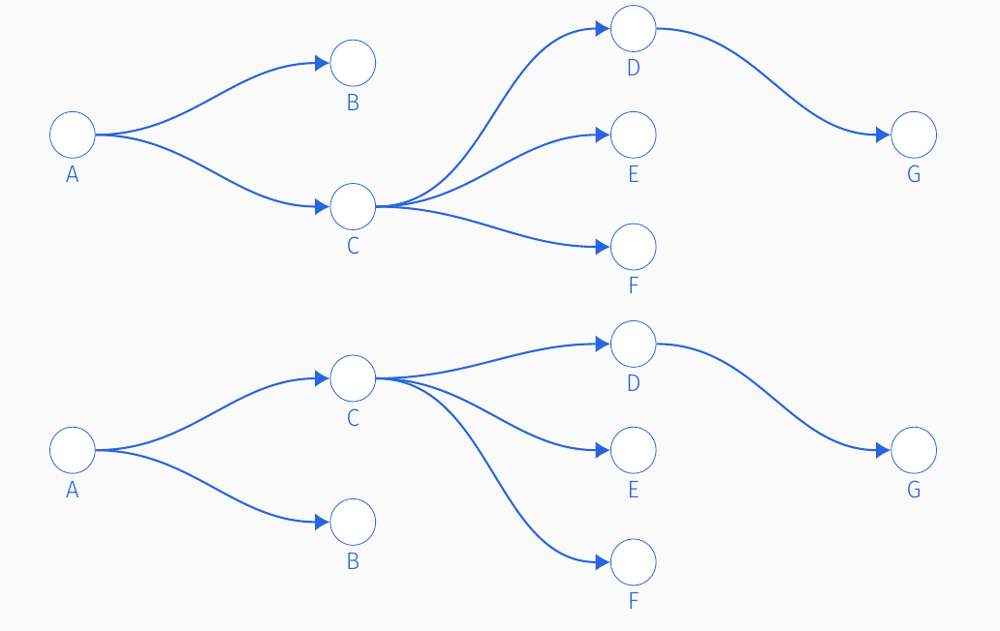

```{r setup, include=FALSE}
knitr::opts_chunk$set(echo = TRUE,
                      cache = TRUE,
                      warning = FALSE,
                      message = FALSE)
devtools::load_all()
library(InfectionTrees)
library(tidyr)
library(dplyr)
library(kableExtra)
library(ggplot2)
theme_set(theme_bw() + theme(axis.title = element_text()))
```


## Vignette goals

In this vignette we will

1. Recap the properties of $\mathcal{T}_C$, the sample space of permissible transmission trees in the base model.

2. Describe our algorithm of how to uniformly sample transmission trees $T_C$.

3. Discuss the relationship between $\mathcal{F}_C$, the sample space of permissible transmission trees  in the multiple outside transmission model,  and $\mathcal{T}_C$.


## Properties of $\mathcal{T}_C$

[Recall](model-overview.html) that $\mathcal{T}_C$ is the space of permissible transmission trees in the base model that result in the cluster $C$.  These are all the **unique** transmission trees that 

1. have $|C|= n$ individuals

2. can be generated from our branching process model described in [the model overview](model-overview.html)


Our transmission trees generated from our branching process are unique in that they are indexed by a generation-index ordered pair $(g,i)$.  This is important because the indexing defines what is a unique transmission tree.

For example, consider the two transmission trees below, which have no indexing.

<center>


</center>

The only  *visual* difference between these two transmission trees is that individuals 'B' and 'C' have swapped sapces.  However, without indexing by both $g$ and $i$ we cannot distinguish between the two trees.  We use indexing ordered pairs so we do not oversample 'equivalent' transmission trees.

[Cayley's formula](https://en.wikipedia.org/wiki/Cayley%27s_formula) says that the number of trees (not necessarily transmission trees) is $n^{n-2}$.  This number is a lower bound for us because our transmission trees are special because of their indexing and having exactly 1 individual in generation 1.  The practical consequence is that the number of transmission trees is **very large** for $n$ as small as 15 and is hence practically infeasible to enumerate all transmission trees in $\mathcal{T}_C$.  This is why we must sample from $\mathcal{T}_C$.

## The algorithm {.tabset}

We draw trees from $\mathcal{T}_C$ in the following manner

1. Draw the number of generations $g$

2. Draw the generation sizes $n_1, \dots, n_g$ and index the nodes

3. Draw the infector ID for each node

4. Draw a permutation of  the covariate labels to the $n$ nodes.


### Draw the generations $g$

The number of generations $g$ is (for $|C|=n > 1$)
$$
Z ~ \sim Binomial(n-2, .5)\\
g \sim 2 + Z
$$
This variable $g$ comes from counting the number of ways to put $n-1$ *indistinguishable* individuals in $g-1$ parts, recalling that one individual is reserved for the first generation.  There are $n-2 \choose g-2$ ways to do this according to the classic [Stars and Bars combinatorial problem](https://en.wikipedia.org/wiki/Stars_and_bars_(combinatorics)).  So if we consider all the different 'boxings' for $g=0, \dots, n-2$, then this is $Z \sim Binomial(n-2, .5)$


### Draw the generation sizes

Conditioned on the number of generations $g$, we would like to uniformly draw a $g-tuple$ $(n_1, \dots, n_g)$ such that $n_1=1$ and $\sum_{i=1}^g n_i = n$.

To do this, we rely on the `R` packages `partitions` and `RcppAlgos`.  The package `partitions` allows us to uniformly draw *partitions* $n_1 = 1 \le n_2  \le \dots \le n_g$.  We then have to uniquely 'permute' the partitions into the allowable set of $g$-tuples which require no such ordering.  The package `RcppAlgos` allows us to 'permute' these partitions where we now consider the values of $n_2, \dots n_g$ as tokens.

To help explain this better consider the following example with $n= 7$ and $g=4$.

The unique *partitions* are

- (1, 2, 2, 2)

- (1, 1, 2, 3)

- (1, 1, 1, 4).


Then the permutations of partitions are

- (1, 2, 2, 2)

- (1, 1, 2, 3); (1, 1, 3, 2); (1, 2, 1, 3); (1, 2, 3, 1); (1, 3, 2, 1); (1, 3, 1, 2)

- (1, 1, 1, 4); (1, 4, 1, 1); (1, 1, 4, 1).

Note that each of the partitions has a different number of permutations depending on how many times a generation size appears in the partition.  This is the most computationally expensive step.

Once we have these generation sizes we index the nodes with the ordered pair $g^*, i^*$.


### Draw the infector IDs

For individual $g^*, i^*$ for $g > 1$, we draw an infector ID $(h, j)$ by the following
$$
j \sim Categorical(n_{g^*-1}, 1 / n_{g^*-1})\\
h = g^*-1.
$$

That is, we randomly select an individual from the previous generation to be person $(g^*, i^*$)'s infector.

### Drawing the covariates

We then randomly permute the covariates/labels from the $C individuals in the clusters to the nodes in the transmission tree.


## Relationship between $\mathcal{T}_C$ and $\mathcal{F}_C$

The space of permissible trees, $\mathcal{F}_C$ for the multiple outside transmissions (MOT) model is described more fully [here](multiple-outside-transmissions-model.html).  The MOT is formed by constructing a transmission tree of size $|C|+1$ where the root node is reserved for a latent outsider.

This means for an observed cluster $C$ with $n$ individuals if we impute outside characteristics $O$, then we have made a new cluster of size $n+1$.  We can then sample transmission trees from $\mathcal{T}_{\{O\cup C\}}$ with one simple modification:  we enforce the first node to have charateristics $O$ and permute the observed characteristics to the remaining nodes.

The consequence is we can re-use much of the work in sampling from $\mathcal{T}_C$ to sample from $\mathcal{F}_C$.
